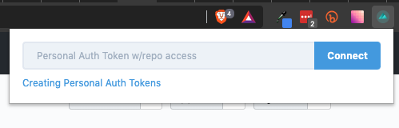

## Github PR Template Picker

**Install dependencies & build**

```bash
yarn && yarn build
```

**Install**

- In Chrome/Firefox/Brave, go to Manage Extensions
- Enable Developer Mode
- Load Unpacked from the `dist` directory

**Usage**

- Generate a personal auth token with repo access (https://github.com/settings/tokens)
- Click the icon to add/remove GitHub person auth token


